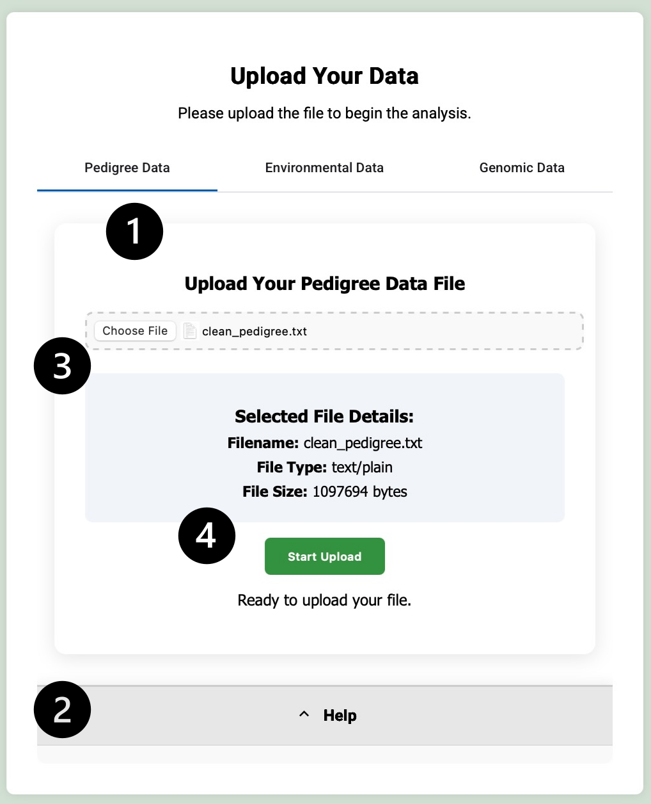
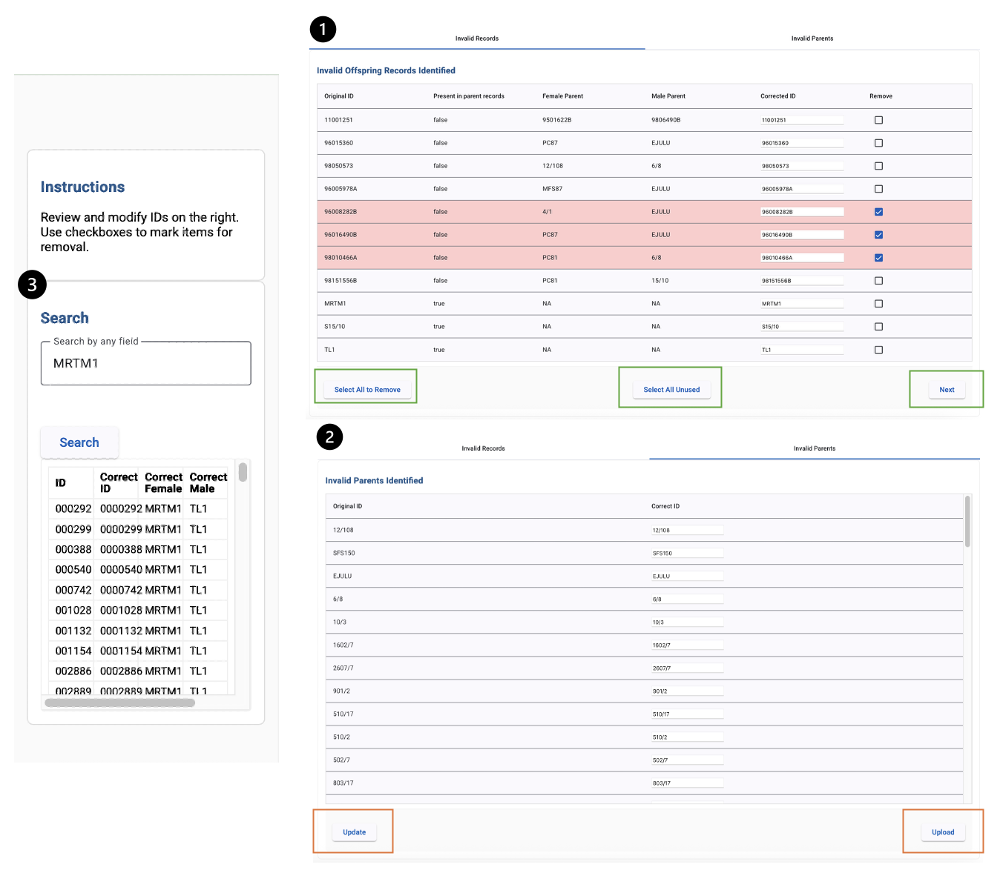
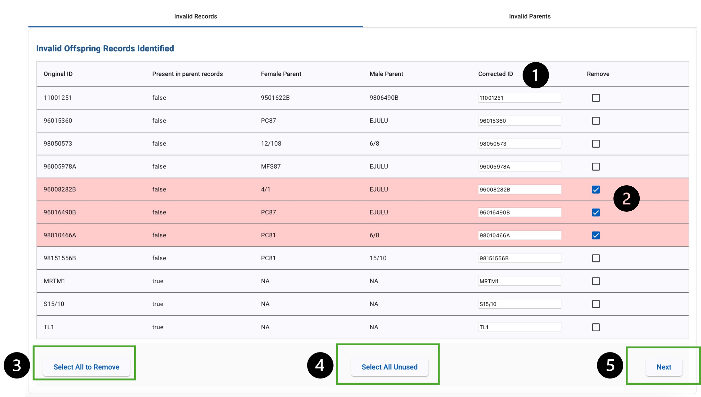
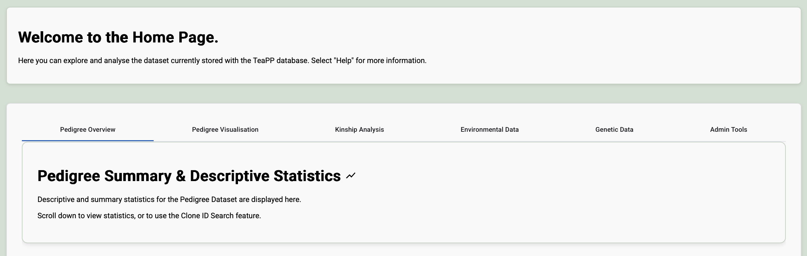
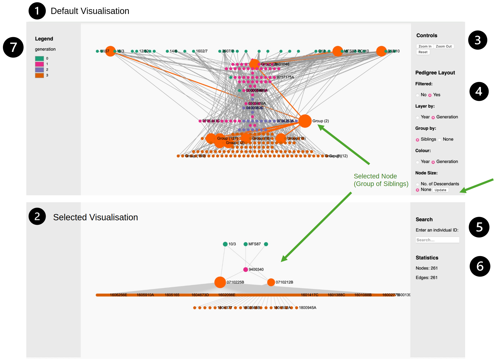
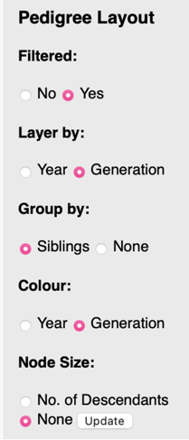
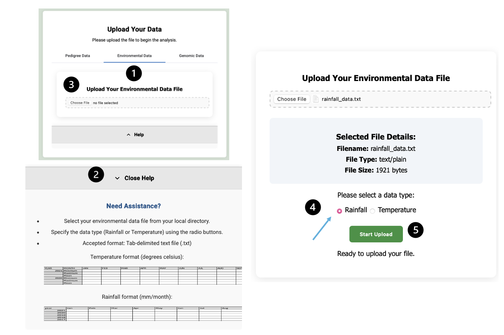
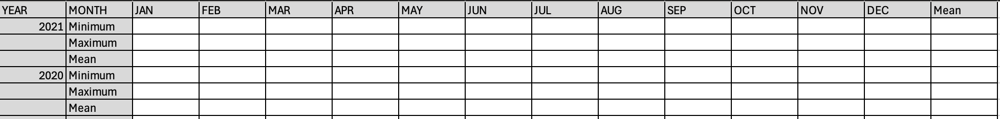
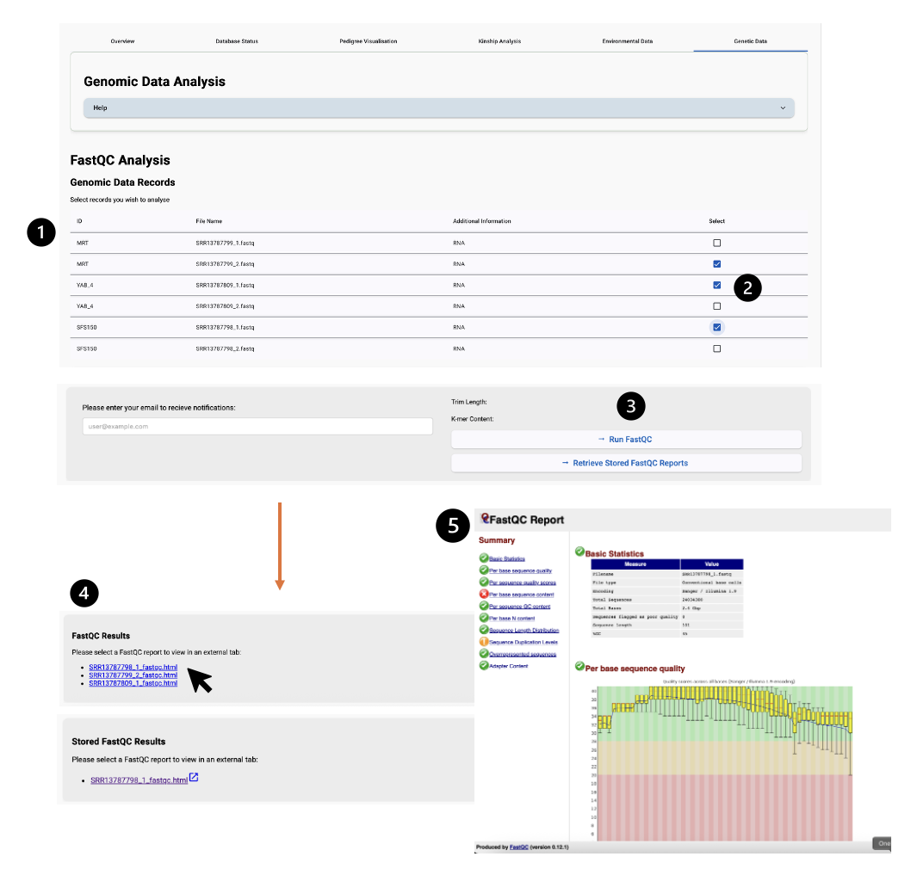

## User Manual

TeaPP is a prototype for the digitalisation, management , analysis and
visualisation of tea plant breeding data in partnership with
Brown/Lipton.

{width="3.746268591426072in"
height="1.9356900699912511in"}

TeaPP can be accessed via GitHub: \_\_\_\_\_\_\_\_\_\_\_\_

Deployment and login access to TeaPP is available on request.

### Accessing the Application on AWS

For each instance deployment of TeaPP there will be a unique IP address
assigned to the application (e.g. 3.10.54.41).

The application is accessed via a web-browser and requires a stable
internet connection.

Steps to access and login into TeaPP (see Figure M 1):

1)  & 2) Enter the IP address into your preferred browsers search bar.

<!-- -->

3)  Enter your username and password

4)  Click Sign In

5)  If your login details are correct your will be navigated to the
    TeaPP Landing Page.

{width="5.464583333333334in"
height="4.8in"}

Figure M 1: User Login steps.

### Landing Page 

After login in the "Landing Page" is displayed.

From the here you can (Figure M2):

1.  Uploading new data.

2.  Analysing Existing Data

3.  Empty existing data from Databases

From the drop-down menu you can navigate to other pages within TeaPP.

{width="7.111111111111111in"
height="4.1125in"}

Additional help can be found in the help-tab by selecting the "help" dropdown or "?" icon.

Figure M 2: The Landing Page.

This is the first page in the User Trajectory (Figure 18). Here the user
can select to upload (1), analyse existing (2) or delete data (3) from
the databases. The top bar contains features accessible from all pages
in TeaPP. The user can also navigate the rest of the application via the
"Menu" dropdown, which will route the display to the respective page.
The "help" pop-out can help accessed via the "?" icon or the Menu and
displays instructions and prompts to the user.

### Home Page 

This is the central page to explore the pedigree dataset currently
loaded in TeaPP. Here the user can move between six key features using
the respective tabs .

- Pedigree Summary Statistics

- Pedigree Visualisation

- Kinship Analysis

- Environmental Analysis

- Genomic Analysis

- {width="7.582040682414698in"
  height="2.9208333333333334in"}Administrative Tools

Figure M 3: The Home Page. The tab specifying each other implemented
analysis and management features currently available in TeaPP, including
an overview of Summary & Descriptive Statistics (default view), Database
Management & Status, Pedigree Visualisation, and Kinship, Environment
and Genomic Analysis respectively. The user can navigate through these
by selecting each. The current user is display in the top-right corner
(green box), whilst "dataset" sits as a pacemaker for the future
development of a multi-dataset management system, where the current
selected dataset is displayed.

### Administrative Tools

Administrative functionalities can be accessed via the "Admin Tools"
tab.

**[Database Management]{.underline}**

Here the user can (Figure M7):

- View (1) PostgresSQL and (2) Neo4j database status respectively

  - Each database's status is indicated by a "live" or "offline" status
    (highlighted by orange box).

- Refresh database status tables (3).

- Restart the connection to each respective database (4).

If either database is highlighted as "offline" it is recommended to
restart the database to ensure all analytic features and data upload can
function successfully.

{width="5.905555555555556in"
height="3.8680555555555554in"}

**[Search feature]{.underline}**

The user can search database to find partially matching entries to a
search term (Figure M 8).

Instructions for Searching:

1.  Enter search term into Search bar

2.  Click "Search".

3.  The page will show a loading screen, and if matching results are
    returned tables will be displayed (Figure M 8(2&4)).

4.  The PostgreSQL can be expanded to view individual entries that have
    been aggregated by year-wide-siblings.

{width="5.905555555555556in"
height="3.720138888888889in"}

### Pedigree Data 

Pedigree data detailing the breeding population can be uploaded,
analysed and visualised within TeaPP.

#### Pedigree Upload.

Within the upload page the user can navigate to the "Pedigree Data" tab
to start uploading their data file.

{width="3.952777777777778in"
height="4.879861111111111in"}

Figure M 6: Pedigree Upload GUI. (1) The "Pedigree Data" tab where the
user can (2) view the "Help" menu to see the file specifics, (3) choose
the file from their local directory, and (4) start uploding the file
after intial checks and statistics are displayed.

Steps to upload a pedigree dataset (Figure) :

1)  Select the "Pedigree Data" tab in the Upload Page display

2)  The "Help" drop-down displays useful information regarding file
    specifics, including file type, column names.

{width="3.14in"
height="1.4939370078740157in"}

3)  Click "Choose file" to select the pedigree data file from your local
    directory.

4)  After the file type is checked, the file statistics are displayed
    before the user for choose to start uploading the file via the
    "Upload" button.

The uploaded pedigree data can be manually reviewed to ensure pedigree
integrity before storage. "Invalid" Clone IDs, those that don't match
the Brown/Lipton nomenclature, are flagged and displayed to the user to
view.

Pedigree validation page includes (Figure M 7):

1)  **Invalid offspring manual formatting**

> This allows the user to manually reformat or remove offspring records
> in the dataset where its "ID" does not match the Brown/Lipton
> nomeclature.

2)  **Invalid parental removal or updating**

> This allows the user to manually reformat parental records in the
> dataset where its "ID" does not match the Brown/Lipton nomeclature.

3)  **Use the Search feature**

> This allows the user to manually search against their uploaded dataset
> to reformat clone IDs based existing entries to ensure they match, and
> the lineage integrity is retained.

<figure>

<figcaption>
Figure M 7: Components of the Invalid Records table
displayed after the integrated pedigree data (1) The invalid offspring
records for display and review, followed by the (2) Invalid Parents or
Founders identified for reformatting. (3) The use can utilised the
search feature to look up entries within their uploaded dataset to make
manual cross-comparisons to ensure the records are
matching.
</figcaption>
</figure>

#### Assessing Invalid Offspring 

The invalid offspring, those bred resulting from the breeding programme
that do not match the nomeclature are highlighted in the displayed
table.

{width="5.905555555555556in"
height="3.34375in"}Figure M 8: Invalid Offspring GUI. The user can
manually reformat the Clone IDs of the invalid offspring (1) or select
them for removal (2). (3) Option to select all those in the list or (4)
only offspring that have not been used as active breeders in the
population based on their ID. (5) Then the user can proceed to reviewing
the invalid parental records.

The user can follow these steps to update the clone IDs (Figure \_\_):

1)  The user can manually type in the reformatted Clone ID into the
    corresponding input bar.

2)  Entries for removal can be selected via the "Remove" column by click
    the check-box. This highlights the entry in red.

3)  Optionally the user can click "Select all to remove" -- this will
    highlight all entries displayed to be removed.

4)  Alternatively, "Select all unused" allows the user to select only
    those that are not used as breeding parents in the dataset.

5)  "Next" moves the GUI to the next reviewing page for the user to
    review invalid parents/founders. The reformatted entries are not
    uploaded until after this step.

#### Assessing Invalid Parents/Founders

The invalid parental records, those that have been used as parents but
do not correspond to an offspring records, therefore are potential
founders, can be reviewed.

{width="5.905555555555556in"
height="3.78125in"}

The user can review parental records by:

1)  Manually reformatting the clone ID of the record.

2)  "Update" allows the user to send the reviewed entries for comparison
    against the dataset. If any of the reformatted entries
    correspond/match parental records present in the dataset then
    dataset and list are updated accordingly. The new list is displayed
    to the user.

3)  "Upload" confirms the reviewing and formatting of both invalid
    offspring and parental records. This starts the final processing and
    uploading pipeline.

4)  After the data upload is finalised, the user is redirected to the
    Home Page of TeaPP to start data analysis and exploration.

### Pedigree Summary & Descriptive Statistics

Upon reaching the Home Page, TeaPP calculates summary statistics for the
uploaded pedigree data (Figure ). This includes descriptive statistics
and metrics detailing characteristics such as the frequency of offspring
per generation, year, or the number of twins identified.

<figure>

<figcaption>
Figure M 10: Summary &amp; Descriptive Statistics Page. A
selection of descriptive metrics are calculated and displayed to the
user regarding the uploaded pedigree data. These inlcude plants per
generation, twin and sibling frequencies, plants bred per year. Summary
venn diagrams and an interactive HTML histogram of plants bred per year
and are displayed.
</figcaption>
</figure>

### Pedigree Visualisation

Upon successful upload and storage of the plant pedigree data,
visualisation of the data can be achieved in the "Pedigree
Visualisation" tab of the Home-Page.

The "Pedigree Visualisation" tab

{width="5.905555555555556in"
height="4.296449037620297in"}

(1)The default visualisation for a pedigree dataset appears in the top
container. One a node is selected/ searched a secondary pedigree
detailing the respective linear pedigree family is displayed in the
bottom container (2). The side panels contain (3) Zoom In/Out controls,
(4) Pedigree layout parameters, (5) Plant Search Bar, (6) Basic
Statistics on the Secondary diagram. (7) The node colour legend for
displayed graph.

### Pedigree Layout Parameters

The top container, displaying the entire pedigree dataset can be
modified via the selection of a range of parameters.

[Filtered:]{.underline}

> If selected, the nodes are filtered by use as a breeding individual.
> Plants that do not have descendants of a higher generation (children)
> are removed, unless they are of the most recent generation, then they
> are retained.

[Layer By:]{.underline}

> **Year** - Nodes are layered ascending (earliest to latest) order of
> their cross "year" as determined by the Brown/Lipton nomenclature.
> "Founders" are manually layered at the top.
>
> **Generation** -- Nodes are layered by their assigned "generation"
> (Synbreed - (Wimmer et al., 2012) in ascending order (oldest to
> youngest).

[Group By:]{.underline}

> **Siblings** -- Plants that are year-wide-siblings (same parents, same
> year) are aggregated as represented as a single node.
>
> **None** -- All nodes that present are represented individually.

[Colour:]{.underline}

> **Year** - Nodes are coloured ascending (earliest to latest) order of
> their cross "year" as determined by the Brown/Lipton nomenclature.
>
> **Generation** -- Nodes are coloured by their assigned "generation"
> (Synbreed - (Wimmer et al., 2012).

[Node Size:]{.underline}

> **No. of Descendant's** -- The node's size is scaled to the number of
> identified descendants within the population.
>
> **None** -- Nodes remain the uniform default size.

The "default" visualisation is set to be filtered, grouped by siblings,
layered by year, coloured by generation and no node scaling.

{width="1.05in"
height="2.6909722222222223in"}

To change the pedigree layout:

1)  Selected your chosen parameters by selecting the respective radio
    buttons.

2)  Click "update" (Figure M 9 -- 4- green arrow).

3)  This will display a loading screen while the graph is loading.

4)  The updated graph will be displayed in the top container for
    interactive exploration.

### Node Selection & Searching 

{width="1.3118055555555554in"
height="1.1069444444444445in"}

A specific node of interest can be selected from the top container
(Figure M 9 -- 1) or searched to display its linear pedigree (bottom
container) (Figure M 9 -- 2 & 5).

Follow these steps to display a linear pedigree visualisation:

1)  The node can be selected the top pedigree visualisation (Figure
    \_\_\_ 1) via clicking on the desired node, or by using the search
    feature to find and select a plant via its Clone ID.

2)  After selection the bottom visualisation with load the respective
    pedigree graph.

Figure M 12 shows an exemplar linear pedigree graph. Colours are adopted
from the parameters set in the Primary pedigree visualisation. (e.g.
year or generation). Node size is automatically scaled to show number of
descendants.

<figure>

<figcaption>
Figure M 12: Close up of secondary linear pedigree
visualisation. The select individuals (either singular or group of
siblings) are highlighted in bright orange.
</figcaption>
</figure>

### Kinship Analysis 

Calculation of a kinship matrix can be performed by selecting the
"Kinship Analysis" tab.

The follow these steps (Figure M10).:

1.  You can choose to ether retrieve a previously performed and stored
    version of the kinship matrix and plots

2.  Calculation a new kinship matrix. An email can be provided to send
    notifications for the end of the analysis pipeline.

3.  If your environment does not meet the computational requirements,
    the analysis cannot be performed, and an alert will be displayed.

4.  If the kinship matrix calculation and visualisation is successful,
    the respective plots will be displayed to the user.

{width="5.905555555555556in"
height="5.722916666666666in"}

The user can either select to view the stored results of a kinship
analysis (1)(implemented due to computational memory requirements of
Synbreed Kinship matrix calculation or perform a new Kinship Matrix
calculation (2) if the system performance permits. (3) An alert
implemented to warn of the lack of RAM storage requirements that
prevents TeaPP from performing the Kinship Matrix. This displays the
users current RAM against the 64GB threshold. (4) Exemplar plots
following successful kinship matrix calculation and visualisation.

### Environmental Data 

Contextual environmental data can be uploaded for analysis and
exploration. This currently includes:

- Temperature Records (mean °C/month)

- Rainfall Records (mean mm/month)

### Uploading Environmental Data

<figure>

<figcaption>
Figure M 14: Environmental File upload page. (1)
Selecting the Environmental Data table, (2) The pop-down “Help” tab
detailing upload instructions, (3) Select “choose file” to choose a file
from your local directory. (4) Select the data-type you are uploading –
Rainfall or Temperature. (5) Start upload of the file by clicking “Start
Upload”.
</figcaption>
</figure>

Environmental files (rainfall/temperature records) can be uploaded by
navigating to the Upload Page and following these steps (see Figure
M11):

1)  Select the 'Environmental" tab of the upload display section.

2)  Ensure your data meets the required format specified in the "Help"
    dropdown. This includes:

- Tab-deliminated text file (.txt)

- The file headers as defined and must be formatted in the same manner:

Temperature:

{width="5.905555555555556in"
height="0.7069444444444445in"}

Rainfall:

{width="5.905555555555556in"
height="0.7104166666666667in"}

3)  Your chosen text file can be selected from your local directory.

4)  If they meet the required text file format requirements, you must
    specify the environmental data type: "Temperature" or "Rainfall".

5)  Selecting "Start Upload" to beginning the uploading of the files to
    TeaPP.

6)  An alert will appear if successful, and you will be navigated to the
    Home Page.

### Environmental Analysis 

Currently, the user can select between performing analysis and data
visualisation of Temperature (1) and Rainfall (2) data.

Selecting either analysis options results in the calculation of data
visualisation plot for the respective data-type (3). You can interact
with the plots to display specific metric for points on the plot, zoom,
or pan around the graph.

{width="5.905555555555556in"
height="3.2666666666666666in"}

### Genomic Data 

Genomic data can be uploaded for storage and analysis.

\*\* This is not currently linked or synchronous to
pedigree/environmental records, instead is a place-holder for future
NGS/GS data\*\*\*

### Uploading Genomic Files

{width="5.905555555555556in"
height="4.627777777777778in"}Genomic files can be uploaded by navigating
to the Upload Page and selecting the "Genomic Data" tab (Figure M14)

Figure M 16: Genomic File Upload Page.

GUI for genomic upload page. (1) Selection of "genomic data" tab. (2)
Drop-down "Help" displays file requirements. (3) Option to open local
directory to choose a file(s) to upload. (4) Entering the Clone ID of
the respective files you have chosen. (5) Upload button to begin the
processing of the files.

Genomic files can be uploaded by navigating to the Upload Page and
following these steps (see Figure M14):

7)  Select the "Genomic Data" tab of the upload display section.

8)  Ensure your data meets the required format specified in the "Help"
    dropdown. This includes:

- Fastq file

- Ending in either .fastq or .fq

- Maximum 10GB file size

- Multiple files can be uploaded at once but must be related to the same
  Clone (as names in Clone ID).

9)  Select your chosen Fastq file(s) from your local directory.

10) If they meet the required FastQ format, you can specify the Clone ID
    that the genomic files are related to.

**\*\*\*** All file uploaded together must be related to the same
individual**\*\*\***

11) Selecting "Start Upload" to beginning the uploading of the files to
    TeaPP.

12) An alert will appear if successful, asking if you would like to
    upload another file.

You can now navigate to the Home Page to start the analysis of the
Genomic records.

### Genomic Analysis 

On selection of the Genetic data analysis tab, the user can view and
select genomic records to perform FastQC analysis (Andrews, 2012)
following these steps (see Figure M15):

1)  Uploaded genomic files are displayed in the table

2)  The user can select which genomic file to perform FastQC.

3)  Next the user can select to perform FastQC on the selected files or
    display all stored FastQC records.

4)  After FastQC is performed for all selected files, or have been
    retrieved, they are listed below as links.

5)  The user can select a chosen FastQC report and click to view it as a
    HTML in an additional tab.

<figure>

<figcaption>
Figure M 17: Genetic Data Analysis Page.
</figcaption>
</figure>

This page displays the stored genomic data (1) for the user to select
for FastQC analysis (2). (3)The user can supply an email to receive
optional notifications of the successful start and end of the analysis
pipeline. Successful FastQC report are listed below after completion for
the user to select and open in an external browser tab (4).

### Profile & Settings

From the landing, upload and home page the user can access the profile
page. This currently acts as a placeholder for future functionality to
customise the GUI and manage user settings (Figure 33).

{width="6.835416666666666in"
height="3.828472222222222in"}

## 

Figure M 18: Profile and Setting Page.

Implemented as a placeholder for future user profile management. Orange
box highlights the current user displayed (provided by Apache2
((Behlendorf et al., 1999))). All other features are non-functional but
indicate potential features such as GUI display themes and customisable
pedigree visualisation colours.
